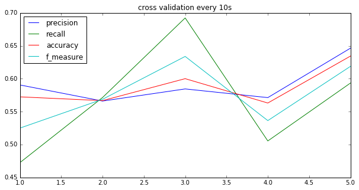
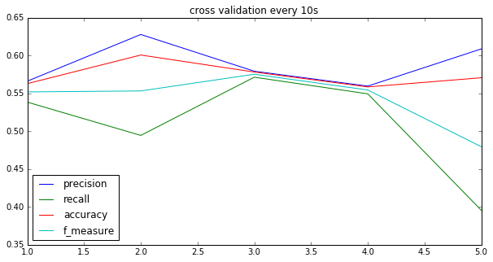

# 1. 实验目的
在预测模型中考虑正向、侧相风的风里与不稳定性，引入上一阶段的重着陆相关性研究中总结的主要相关参数作为模型特征，重新建立预测模型并对其评估。


# 2. 实验步骤
1. 计算每个航段中，着陆前的A300与飞机重着陆相关度较高的参数的：
    1. 只计算对齐VRTG后，MAC_VRTG出现位置前50秒的参数值
    2. 按1hz重新采样，即每秒只取一个参数值
    3. 这一步的输出是：每个航段得到一个50*28的矩阵
2. 对每个航段，计算上一步输出矩阵的5个主成分。保证这5个主成分可以解释原矩阵90%以上的信息。这一步的输出是：每个航段得到50*5的矩阵
3. 对每个航段，按10秒分段，求每段的均值和标准差。这一步的输出是：每个航段得到长为5*5*2=50的向量，将所有航段整合起来得到8509*50的矩阵
4. 给上一步的矩阵增加一列索引为各航段的文件号；增加一列m_vrtg列为该航段的最大着陆垂直载荷；增加一列hard列，如果该航段m_vrtg>0.4，则hard为1，否则为0；增加一列weight列，如果该航段hard为1，则weight为轻着陆行段数占总体的比例，否则为重着陆行段数占总体的比例。
5. 分别以5个10秒的数据为输入，weight列为样本权重，hard列为输出，应用SVM做交叉验证。过程中手动调节SVM的参数C和gamma，使正确率尽量大。
6. 同（5）一样的预处理，应用决策树做交叉验证。过程中手动调节决策树的参数，使正确率尽量大。
- 【关于weight】由于数据集中重着陆样本多，轻着陆样本少，模型容易倾向轻着陆。为重着陆样本赋予较大的权重后，增加对模型训练过程中错判重着陆的惩罚。这里给重着陆样本的权重为轻着陆样本占样本总体的比重，给轻着陆样本的权重为重着陆样本占样本总体的比重，意图使模型对这2类样本保持公平。

# 3.实验结果
## 3.1. SVM实验结果
```
# cv_result来自predict_using_svm.py
columns = ["precision", "recall", "accuracy", "f_measure"]
pd.DataFrame(cv_result, columns=columns, index=np.arange(1, 6)).plot(figsize=(10, 5), title="cross validation every 10s")
```


- 正确率accuracy: 在第5个10秒处取得最大，约为62%
- 查准率precision: 在第5个10秒处取得最大，约为65%
- 查全率recall: 在第3个10秒处取得最大，约为69%
- F1值: 在第3个10秒处取得最大，约为63%

- 结论：根据以上实验结果，距离着陆时间越近，预测重着陆越精确；在着陆时间前的某个时间点，预测的重着陆数量会比较多。

## 3.2. 决策树实验结果
```
# cv_result来自predict_using_decision_tree.py
columns = ["precision", "recall", "accuracy", "f_measure"]
pd.DataFrame(cv_dt_result, columns=columns, index=np.arange(1, 6)).plot(figsize=(10, 5), title="cross validation every 10s")
```

- 正确率accuracy: 在第2个10秒处取得最大，约为60%
- 查准率precision: 在第2个10秒处取得最大，约为63%
- 查全率recall: 在第3个10秒处取得最大，约为57%
- F1值: 在第3个10秒处取得最大，约为58%
